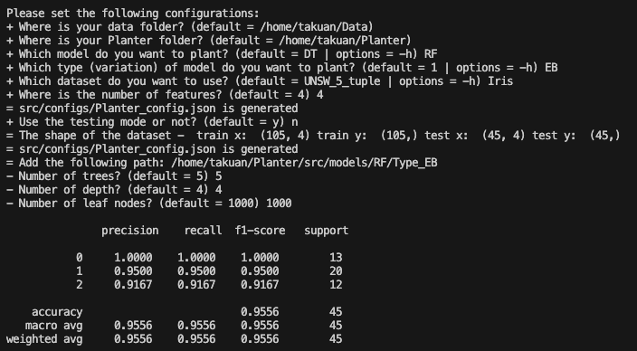
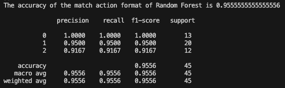
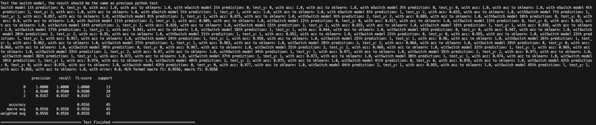

# GSoC 2026 — Project 3.3: Integrating Planter into P4Pi

**Applicant:** Takumi Ishihara ([@takuan517](https://github.com/takuan517))  
**Organization:** [P4 Language Consortium](https://p4.org)  
**Project:** [Project 3.3 — Integrating P4-based In-Network ML (Planter) into P4Pi](https://github.com/p4lang/gsoc)  
**Mentor:** Peng Qian (University of Oxford)

---

## Overview

This repository documents my qualification task and application materials for GSoC 2026 Project 3.3.

The project goal is to integrate [Planter](https://github.com/In-Network-Machine-Learning/Planter) — a modular in-network machine learning framework — into [P4Pi](https://github.com/p4lang/p4pi) by adding a new `src/targets/dpdk/` backend that compiles P4 programs via `p4c-dpdk` and runs them using `bf_switchd` on Raspberry Pi.

---

## Qualification Task

The qualification task for Project 3.3 is to run the full Planter end-to-end workflow on BMv2 and report the three accuracy matrices.

### What the task involves

Planter encodes a trained ML model into P4 match-action tables and deploys it onto a P4 switch. The workflow has three validation stages:

| Matrix | What it tests |
|--------|--------------|
| **Matrix 1** | sklearn model accuracy — pure Python, no P4 involved |
| **Matrix 2** | Table logic simulation — ML model → P4 match-action tables, validated in software |
| **Matrix 3** | BMv2 switch deployment — P4 tables loaded onto a Mininet software switch via P4Runtime |

All three matrices must match, confirming that the model is correctly translated from sklearn → P4 tables → live switch packet classification.

### Configuration

| Parameter | Value |
|-----------|-------|
| Model | Random Forest / Type EB |
| Dataset | Iris (4 features, 3 classes) |
| Trees | 5 |
| Max depth | 4 |
| Leaf nodes | 1000 |
| P4 architecture | v1model |
| Use case | performance |
| Target | BMv2 software |
| Runtime | Mininet + simple_switch_grpc + P4Runtime gRPC |

### Environment

| Component | Details |
|-----------|---------|
| Machine | Apple Silicon M5 (Mac) |
| VM | UTM (ARM virtualization) |
| OS | Ubuntu 24.04 LTS ARM64 |
| Python | 3.12 |
| p4c | v1.2+ |
| Planter | main branch |

---

### Results

| Matrix | Description | Accuracy |
|--------|-------------|----------|
| Matrix 1 | sklearn Random Forest on test set | **0.9556** |
| Matrix 2 | P4 table logic simulation | **0.9556** |
| Matrix 3 | BMv2 switch (live packet classification) | **0.9556** ✔ |

All three matrices match. The RF model is correctly encoded into P4 match-action tables and executes accurately on a software switch.

### Screenshots

#### Matrix 1 — sklearn accuracy


#### Matrix 2 — P4 table logic simulation


#### Matrix 3 — BMv2 switch deployment + Test Finished


---

### Full execution log

<details>
<summary>Click to expand — <code>python3 Planter.py -m</code> full output</summary>

```
(p4dev-python-venv) takuan@ubuntu1:~/Planter$ python3 Planter.py -m
 ____    ___                    __ 
/\  _`\ /\_ \                  /\ \__ 
\ \ \L\ \//\ \      __      ___\ \ ,_\    __  _ __ 
 \ \ ,__/ \ \ \   /'__`\  /' _ `\ \ \/  /'__`/\`'__\ 
  \ \ \/   \_\ \_/\ \L\.\_/\ \/\ \ \ \_/\  __\ \ \/ 
   \ \_\   /\____\ \__/.\_\ \_\ \_\ \__\ \____\ \_\ 
    \/_/   \/____/\/__/\/_/\/_/\/_/\/__/\/____/\/_/ 
                                      Version 0.1.0

[... configuration prompts ...]
Model: RF, Type: EB, Dataset: Iris, features: 4, trees: 5, depth: 4, leaves: 1000
Architecture: v1model, Use case: performance, Target: bmv2/software

--- Matrix 1: sklearn accuracy ---

               precision    recall  f1-score   support

           0     1.0000    1.0000    1.0000        13
           1     0.9500    0.9500    0.9500        20
           2     0.9167    0.9167    0.9167        12

    accuracy                         0.9556        45
   macro avg     0.9556    0.9556    0.9556        45
weighted avg     0.9556    0.9556    0.9556        45

--- Matrix 2: P4 table logic simulation ---

The accuracy of the match action format of Random Forest is 0.9555555555555556

               precision    recall  f1-score   support

           0     1.0000    1.0000    1.0000        13
           1     0.9500    0.9500    0.9500        20
           2     0.9167    0.9167    0.9167        12

    accuracy                         0.9556        45
   macro avg     0.9556    0.9556    0.9556        45
weighted avg     0.9556    0.9556    0.9556        45

--- Matrix 3: BMv2 switch deployment ---

[Mininet + simple_switch_grpc startup, P4Runtime table loading...]

Switch model 45th prediction: 1, test_y: 1, with acc: 0.956, ..., M/A format macro f1: 0.9556, macro f1: 0.9556

               precision    recall  f1-score   support

           0     1.0000    1.0000    1.0000        13
           1     0.9500    0.9500    0.9500        20
           2     0.9167    0.9167    0.9167        12

    accuracy                         0.9556        45
   macro avg     0.9556    0.9556    0.9556        45
weighted avg     0.9556    0.9556    0.9556        45

======================================= Test Finished ========================================

Process <load data>      cost 0.0022s
Process <train model>    cost 0.0148s
Process <convert model>  cost 0.0158s
Process <python-based test> cost 0.0547s
```

</details>

---

## Bug Fix Discovered During Qualification: PR #7

While running the qualification task on Python 3.12 / Ubuntu 24.04, I encountered a `KeyError: 0` crash in `table_generator.py`. I identified the root cause, fixed it across the entire codebase, and submitted a pull request.

### Root cause

`packages.txt` pins `pandas==1.1.3` (released 2020). In pandas v2.0+, `.max()[0]` raises `KeyError: 0` because `.max()` returns a `Series` indexed by column name, not position:

```python
# Pattern used in all 51 table_generator.py files — breaks on pandas >= 2.0:
t_t = [test_X[[i]].max()[0], train_X[[i]].max()[0]]
```

### Fix

```python
# Compatible with both pandas v1.x and v2.x:
t_t = [test_X[[i]].max().iloc[0], train_X[[i]].max().iloc[0]]
```

### Scope

Applied to all **51 `table_generator.py` files** across every ML module: `RF`, `DT`, `XGB`, `SVM`, `KNN`, `KM`, `NN`, `Bayes`, `IF`, `PCA`, `Autoencoder`

🔗 **PR #7:** https://github.com/In-Network-Machine-Learning/Planter/pull/7

---

## Dependency Issue: Issue #8

As a follow-up, I filed an issue proposing that all pinned dependencies in `packages.txt` be updated for Python 3.12 compatibility. All current pins are from 2019–2020:

```
scipy==1.5.2      # Released 2020
pandas==1.1.3     # Released 2020
numpy==1.19.2     # Released 2020
torch==1.4.0      # Released 2020
xgboost==0.90     # Released 2019
matplotlib==3.3.2 # Released 2020
```

🔗 **Issue #8:** https://github.com/In-Network-Machine-Learning/Planter/issues/8

---

## Repository Structure

```
.
├── README.md
└── screenshots/
    ├── matrix1_sklearn.png   ← Matrix 1: sklearn accuracy
    ├── matrix2_table.png     ← Matrix 2: P4 table logic simulation
    └── matrix3_bmv2.png      ← Matrix 3: BMv2 switch deployment
```

> The proposal is shared directly with the mentor and is not included in this repository.

---

## Contact

- Email: takuan@sfc.wide.ad.jp
- GitHub: [@takuan517](https://github.com/takuan517)
- Affiliation: Ph.D. Student, Graduate School of Media and Governance, Keio University (Cyber Informatics Course)